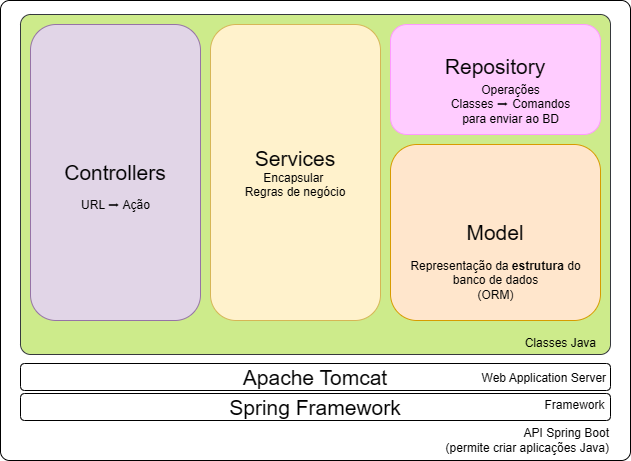
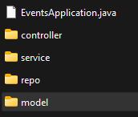
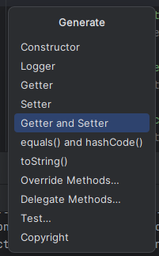
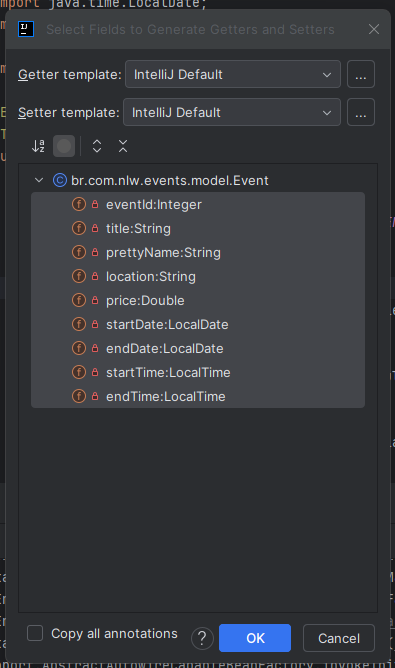

[](https://git.io/typing-svg)

Bem-vindo a API para Gestão de Eventos, um projeto desenvolvido com objetivo de gerenciar eventos e suas respectivas inscrições, gerar links de indicação, validar as regras de negócio, e acompanhar ranking de indicações.

<p align="center">
  <a href="#-tecnologias-utilizadas">🛠 Tecnologias Utilizadas</a>&nbsp;&nbsp;&nbsp;|&nbsp;&nbsp;&nbsp;
  <a href="#-tecnologias-utilizadas">🧠 Como Usar</a>
</p>


# 🚧 Em construção... 🚧

Nessa trilha, explorei conceitos fundamentais do e **Java** e **Spring Boot**, mergulhando na prática para construir uma aplicação completa de **inscrição em eventos**.  

Ao longo do curso, configurei o ambiente de desenvolvimento, utilizamos o **Spring Initializr** para criar nosso projeto e conectamos a aplicação a um banco de dados **MySQL**.  

## ✨ Funcionalidades

- 📌 **Inscrição**: O usuário pode se inscrever no evento usando nome e e-mail.
- 🔗 **Geração de Link de Indicação**: O usuário pode gerar um link de indicação (um por inscrito).
- 📊 **Ranking de Indicações**: O usuário pode ver o ranking de indicações.
- 👥 **Visualização de Indicações**: O usuário pode ver a quantidade de inscritos que ingressaram com seu link.

## 🛠 Tecnologias Utilizadas

- **Docker Desktop** 4.38.0
- **MySQL Workbench** 8.0.41 Community
- **IntelliJ IDEA** 2024.3.3 (Community Edition)
- **Postman** v11.33.4

- **Java** 23.0.2

- **Maven**  
- **Lombok**
- **MySQL** 8.4
- **Spring Boot** 3.4.2
- **Dependências**:
  - Spring Web
  - Spring Data JPA
  - MySQL Driver
  - Spring Boot DevTools

# O que é ...

## ... uma API? 

Uma API (do inglês Application Programming Interface, ou Interface de Programação de Aplicações) é um conjunto de regras, protocolos e ferramentas que permite que diferentes sistemas ou componentes de software se comuniquem entre si. Ela define como as solicitações e respostas devem ser estruturadas, permitindo que desenvolvedores integrem funcionalidades de um sistema em outro sem precisar entender todos os detalhes internos de implementação.

> "Ela é um sistema que 'alimenta' outros sistemas, permitindo que eles se comuniquem e troquem informações."

## ... um Framework ?
Fornece uma estrutura pronta com ferramentas e bibliotecas para facilitar o desenvolvimento de aplicações.

> Estrutura de código pré fabricado.

#### Spring Boot
Ele faz parte do ecossistema Spring, que é um dos frameworks mais populares para desenvolvimento de aplicações em Java. O Spring Boot foi criado para simplificar o processo de configuração e desenvolvimento de aplicações Spring, permitindo que os desenvolvedores criem aplicações prontas para produção de forma rápida e eficiente.

##### Spring Initializr

O Spring Initializr é uma ferramenta online e também uma integração em IDEs (como IntelliJ IDEA e Eclipse) que facilita a criação de projetos Spring Boot. Ele permite que você configure rapidamente um projeto Spring Boot, escolhendo as dependências, a linguagem (Java, Kotlin ou Groovy), a versão do Spring Boot e outras configurações básicas. Em seguida, ele gera um projeto inicial (um "esqueleto") que você pode importar e começar a desenvolver.

> Gera um arquivo .ZIP com o projeto inicial com todas as dependências necessárias para começar a desenvolver uma aplicação Spring Boot.

Para gerar o seu "pacote": [Acesse Aqui](https://start.spring.io/)

Configurações escolhidas
```
Project: Maven
Language: Java
Spring Boot: 3.4.2 //sempre escolher a versão estável

Project Metadata:
Group: br.com.nlw
Artifact: events
Name: events
Description: Events Manager System
Package name: br.com.nlw.events
Packaging: Jar
Java: 23 //Escolha a menor/igual versão mais próxima da versão do Java que você está usando

Dependencies:
Spring Web
Spring Data JPA
MySQL Driver
Spring Boot DevTools
```


###### Dependências
- Spring Web
  - Suporte para criar aplicações web e APIs RESTful. Ele inclui o Spring MVC (Model-View-Controller), que é um framework para construir aplicações web no ecossistema Spring.
  - Usa o Apache **Tomcat** como servidor web padrão.
- Spring Data JPA
  - É uma camada de abstração sobre o JPA (Java Persistence API), que simplifica o acesso a bancos de dados relacionais. Ele permite que você interaja com o banco de dados usando interfaces e métodos, sem precisar escrever consultas SQL manualmente.
- MySQL Driver
  - É uma biblioteca que permite que sua aplicação Java se conecte a um banco de dados MySQL. 
- Spring Boot DevTools
  - Conjunto de ferramentas de desenvolvimento que aumentam a **produtividade** durante o desenvolvimento de aplicações Spring Boot. Exemplos:
    - Reinicia automaticamente a aplicação quando arquivos são alterados (sem precisar parar e iniciar manualmente).
    - Atualiza automaticamente o navegador quando recursos estáticos (como HTML, CSS, JS) são modificados.

## ... um Web Application Server ?
Um Web Application Server é um servidor que fornece um ambiente para executar aplicações web. Ele suporta tecnologias como Servlets, JSP (JavaServer Pages), EJB (Enterprise JavaBeans), JMS (Java Message Service) e outras especificações da plataforma Java EE (ou Jakarta EE).

### Apache Tomcat, ou simplesmente Tomcat
O Apache Tomcat é tecnicamente um Servlet Container (Contêiner de Servlets) e um JSP Container (Contêiner de JSP). Ele implementa as especificações de Servlet e JSP, que são partes essenciais da plataforma Java EE. No entanto, o Tomcat não implementa todas as especificações Java EE, como EJB, JMS ou JTA (Java Transaction API), que são comuns em servidores de aplicações completos.

Por isso, o Tomcat é frequentemente chamado de Web Server ou Servlet Container, mas também pode ser considerado um Web Application Server leve, já que ele é capaz de executar aplicações web Java, embora com funcionalidades mais limitadas em comparação a servidores de aplicações completos.

## ... um Banco de dados ?

Um banco de dados é um sistema organizado para armazenar, gerenciar e recuperar informações. Imagine uma grande biblioteca onde os livros são os dados, e as prateleiras e catálogos ajudam a encontrar o que você precisa rapidamente. Ele permite que você guarde dados de forma estruturada (como tabelas) e os acesse, atualize ou apague quando necessário. 

### 🐳 Docker

No contexto de bancos de dados, o Docker serve para criar e gerenciar containers que isolam e rodam bancos de dados de forma rápida, portável e consistente. Ele simplifica a configuração de ambientes.

Configurando:

1. Deixe o `Docker Desktop` executando em sua máquina. 
2. Na pasta do projeto `\assets\create_db` você irá encontrar um arquivo chamado `docker-compose.yml`. Que irá conter as seguintes informações:

<br>

`docker-compose.yml`
```
services:
  mysql:
    image: mysql:8.4
    restart: always
    container_name: mysql-nlw
    environment:
      - MYSQL_ROOT_PASSWORD=mysql
    ports: 
      - '3306:3306'
    networks: 
      - nlw-network
networks:
  nlw-network:
    driver: bridge
```

3. Entre no terminal do seu sistema operacional. E navegue até o diretório onde está o arquivo `docker-compose.yml`. Então execute o seguinte comando:
```
docker compose up
```
Assim ele criará a `Network` (rede), o `Container` e faz o upload do `MySQL` para o docker. 


4. Agora é só criar a seu Banco de Dados.

### 🔢 Criando o Banco de dados

1. Acesse o MySQL Workbench
2. Em `MySQL Connections`, clique em `+`
3. Então configure ele:
   - Connection Name: `Mysql NLW Docker`
4. `Ok`
5. No ícone da pasta, abra o arquivo do script do banco de dados: `db_events.sql`. Você pode encontrar ele na pasta do projeto `\assets\create_db`
6. Então execute (símbolo do raio)
7. Pronto o banco de dados esta gerado 

> Para ver o diagrama vá em Database > Reverse Enginneer > Next > Next > selecione o banco desejado > Next > Next > Execute > Next > Finish

### 🔌 Conectando Código com o Banco de Dados

Requisito: Dependências do `Spring Data JPA`
Caminho: `\events\src\main\resources`
Arquivo: `application.properties`

> O maior gargalo de uma aplicação é a comunicação com o banco de dados. Quanto melhor o BD, melhor a aplicação.

 ``` java
spring.application.name = events

// Nome do usuário do banco de dados
spring.datasource.username = root 

// Senha do usuário do banco de dados
spring.datasource.password = root 

// URL do banco de dados
// Protocolo: jdbc:mysql: <- Eu quero conversar atráves do JPA, pelo protocolo JAva Database Connectivity, usando o driver de conexão do MySQL
// Máquina: localhost <- A máquina que está rodando o banco de dados
// Porta: 3336 <- Porta que o banco de dados está escutando (OPCIONAL)
//Nome da base de dados: db_events
spring.datasource.url = jdbc:mysql://localhost:3306/db_events

// Configuração do JPA "Qual dialeto estou usando?" = MySQL
spring.jpa.properties.hibernate.dialect = org.hibernate.dialect.MySQLDialect
 ```
Resultado esperado: Conexões criadas com o BD


## Criando Packages

Então vamos criar os pacotes:
- Controller
- Service
- Repository
- Model



Primeiro temos que estar no caminho correto: `\events\src\main\java\br\com\nlw\events`

E crie um novo pacote:


- `.controller`
- `.service`
- `.repo`
- `.model`

Cada pacote irá criar uma nova pasta dentro do pacote `br.com.nlw.events`



## Criando Classes

### Model

Objetivos:
- Declarar variáveis.
- Relacionar variáveis com o BD.
- Criar métodos getters e setters.

Tipo: `Java Class`

Nome do arquivo: `Event.java`

1. Declarar variáveis. Veja na tabela do BD, o nome das colunas e seus tipos. Para o código manter a mesma nomenclatura, para que não tenha erros. Mas use a anotação utilizada pelo Java. `primeiraLetraMaiusculaEORestanteMinuscula`

  Veja o Exemplo:

  .png>)

  Possível problema:

  

  Tipo de variável não existente, passe o mouse sob o erro e Importe a classe.

2. "Anotar" que a essa classe corresponde a uma tabela `tbl_event` do BD.

  ```java
  @Entity
  @Table (name = "tbl_event")
  ```

3. Indicar cada variável que é uma coluna da tabela.

  ```java
  @Column (name = "pretty_name", length = 50, nullable = false, unique = true)
  private String prettyName;
  ```

  Para a chave primária, use:

  ```java
  @Id
  @GeneratedValue (strategy = GenerationType.IDENTITY)
  @Column (name = "even_id")
  private Integer eventId;
  ```

4. Criar os métodos getters e setters para cada variável.

Vá no menu Code > Generate >


.> Getter and Setter >



.> Selecionar todas as variáveis > Ok



Ele irá criar os métodos getters e setters para todas as variáveis, semelhante ao exemplo abaixo:

```java
    public Integer getEventId() {
        return eventId;
    }

    public void setEventId(Integer eventId) {
        this.eventId = eventId;
    }
```

### Repository (Repo)

Objetivos:

Tipo: `Interface`

Nome do arquivo: `EventRepo.java`

1. Adicione a extensão `CrudRepository`. Ela pede dois parâmetros:
   - O que vou armazenar. No caso, a classe `Event`. 
   - Tipo da chave primária.
   
```java
public interface EventRepo extends CrudRepository <Event, Integer> {
  //aqui vai ficar os métodos extras que o CrudRepository não tem
}
```	

Com o CrudRepository, você tem acesso aos métodos:

- Create (Criar):
  - save(entity): Salva uma entidade no banco de dados (insere ou atualiza, se já existir).

- Read (Ler):
  - findById(id): Busca uma entidade pelo seu ID.
  - findAll(): Retorna todas as entidades.
  - existsById(id): Verifica se uma entidade com o ID especificado existe.

- Update (Atualizar):
  - save(entity): Atualiza uma entidade existente no banco de dados.

- Delete (Excluir):
  - deleteById(id): Remove uma entidade pelo seu ID.
  - delete(entity): Remove uma entidade específica.
  - deleteAll(): Remove todas as entidades.

### Service

Objetivos:
- Regras de negócio
- Cadastrar
- Recuperar todo mundo
- Recuperar pelo `prettyName`

Tipo: `Java Class`

Nome do arquivo: `EventService.java`


1. Adicione a anotação `Service`.
```JAVA 
@Service
public class EventService {
}
```
Mas por que? Porque o Spring vai gerenciar a criação dessa classe.

2. Chame a Classe `EventRepo` (que acabamos de criar no arquivo anterior)

```JAVA 
private EventRepo eventRepo;
```

3. Coloque a anotação `Autowired` acima do `eventRepo`

```JAVA 
@Autowired
private EventRepo eventRepo;
```

#### Autowired

## 📋 Rotas da API

Principais rotas da API:

🎟️ Eventos

- Criar um evento
    ```
    (POST) /events
    ```
- Listar todos os eventos
    ```
    (GET) /events
    ```
- Obter evento por nome formatado
    ```
    (GET) /events/{prettyName}
    ```

📝 Inscrição

- Realizar inscrição no evento
    ```
    (POST) /subscription/{prettyName}
    ```
- Ver indicações de um usuário específico
    ```
    (GET) /subscription/{prettyName}/ranking/{userId}
    ```

↗️ Rankings

- Visualizar ranking de indicações de um evento
    ```
    (GET) /subscription/{prettyName}/ranking/{userId}
    ```
- Visualizar ranking de indicações de um usuário específico
    ```
    (GET) /subscription/{prettyName}/ranking
    ```


## 📂 Estrutura do Projeto

### Arquivos e Diretórios
```
Sistema-De-Inscricao-Em-Eventos-API-Java-nlw-connect
├── 📂 assets/ 
│    │   
├── 📄 README.md

```
### Diagrama de Deployment (Estrutura da API)


### Diagrama Entidade-Relacionamento (DER)


- Um usuário pode ter várias inscrições em eventos, mas não pode se inscrever em um evento mais de uma vez.
- Um evento pode ter vários usuários inscritos.


## 🖥️ Contribuição

Contribuições são bem-vindas! Se você deseja contribuir para este projeto, siga os passos abaixo:

1. Faça um fork do repositório.
2. Crie uma branch para sua feature (`git checkout -b feature/nova-feature`).
3. Commit suas mudanças (`git commit -m 'Adicionando nova feature'`).
4. Push para a branch (`git push origin feature/nova-feature`).
5. Abra um Pull Request.


<p align="left">

### 🛡️ Licença

Este projeto está sob a licença MIT. Isso significa que você pode utilizá-lo, modificá-lo e distribuí-lo livremente, desde que mantenha os créditos.

### 📧 Contato

Se você tiver alguma dúvida ou sugestão, sinta-se à vontade para entrar em contato:

- GitHub: JuliaComG
- Linkdin: https://www.linkedin.com/in/giulia-armanelli/
- Email: garmanelli.dev@gmail.com

### 💖 Créditos e Agradecimentos 

Quero agradecer à [Rocketseat](https://app.rocketseat.com.br/?type=ALL) pelo conhecimento compartilhado e pelas oportunidades proporcionadas por meio do evento [NLW Connect](https://www.rocketseat.com.br/eventos/nlw?utm_source=platform&utm_medium=organic&utm_campaign=lead&utm_term=nlw_19&utm_content=notificacao_plataforma-lp_inscricao).
